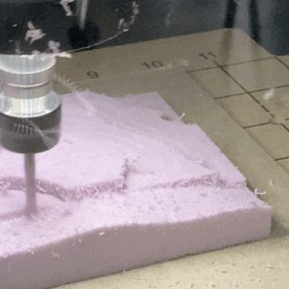

## This is a duplicate site for making/working with templates. It is not updated actively and does not represent the NYIT FAB LAB currnet status

- June 2026 Elijah Williams 

# Formatting and example links:

If you have successfully used this file as a template repo, well done!

You have 2 more steps.
### 1. Turn on Github Pages and Create your Auto Deploying Changes workflow.

Sounds hard, but we are almost done.

## Set your Source as Github Actions (red box #1)

## Click Configure with Jekyll (red box #2)

## Click Commit Changes and then deploy.

## You are done! Now visit your site here:

### 2. Make and push your first edit

# Formatting and example links:

## Lab Rules 
  
1. Top priority is safety. 
  
2. Clean up after yourself. 
  
3. If in doubt, ask for help.
  
4. Respect staff, student workers, each other, and the space/machines/tools 
  
5. The lab is a shared space - put your name/date/contact info on all materials and tools do not leave the shop 
  
***Reminder: Students must complete the Lab Orientation before using any machines/tools***

## Fab Lab Machine Pages

[3D Printing](3Dprinters/README.md)

[CNC Machining](CNCmills/README.md)

## Quick Links For Students

[Tutorials & Templates](/Tutorials&Templates/README.md)

[Submit to the Queue (3D Printing, material purchasing)](https://apps.nyit.edu/fabrication-labs/)

[EZBook - appointment booking (Laser Cutting, CNC)](https://new.ezbook.com/NYIT)

## Hours 

## About Us

[Staff and Contact](https://www.nyit.edu/architecture/fabrication_labs)

## Staff Resources Test

[Fab Lab Queue Login](https://apps.nyit.edu/fabrication-labs-admin/)

[Plot Shop Queue Login](https://apps.nyit.edu/plotting-service-admin/)

[More](UserGuides/StaffResources/)

[.](https://digitalfabricationlab-nyit-soad.github.io/resources/)  
[,](https://github.com/DigitalFabricationLab-NYIT-SoAD/resources/)

